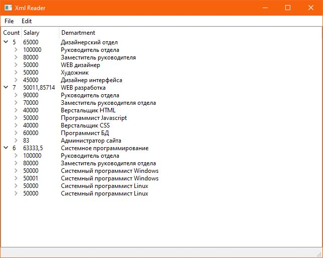

# Test_Task

Тестовое задание на позицию C++/Qt разработчика. Код написан осенью 2021 года. Сохранил на память. Из полезного: работа с SAX-парсером и использование делегатов в Qt. Многопоток с pthread не понятно для чего спрашивали (реализовал recursive mutex фактически, который и так в плюсы добавили позже). В проекте два подпроекта: *xml_tree_edit* - Qt GUI приложение для редактирования конфига, прочитанного из XML-файла с заранее определённым форматом; *readers_writers* - демонстрация синхронизации потоков (1 пишущий и несколько читающих, чтение тут неблокирующее; проявил знание pthread (кринжанул, только тогда прочитал про pthread, но модель и так знал)).  

# Задание

1. Необходимо реализовать схему взаимодействия процессов «читатели-писатели» под ОС Windows с использованием соответствующих системных вызовов WinAPI и многопоточности, используя thread, event, и mutex. Приоритет может быть любым. Потоки должны разделять общее адресное пространство. Количество читателей, писателей, повторов программы, а также временные задержки, задаются директивами препроцессора. Обеспечить вывод на экран результат работы читателей и писателей.

2. Необходимо разработать приложение, отображающее список подразделений предприятия и его сотрудников в виде дерева. Список должен загружаться из файла формата xml. Программа должна обеспечить возможность добавления, удаления, редактирования подразделений и сотрудников в них. Программа должна обеспечить возможность отмены и возврата изменений. При разработке необходимо использовать паттерны проектирования (xml файл с данными прикреплен к заданию). 
 
   Поля сотрудника: - ФИО; - должность; - зарплата (целое число).

   Поля подразделения:
   - наименование;
   - количество сотрудников;
   - средняя зарплата.